```{r setup, echo=FALSE}
knitr::opts_chunk$set(echo = TRUE)
```

```{r, warning=FALSE, echo=FALSE, message=FALSE}
library(vars)
```

<!-- SARANSH -->

# What is Cointegration?

- Important for modelling **long run relationships** between components

--

- Occurs within multiple non-stationary time series

  - Having a long-run equilibrium
  
--
  
  - Their linear combination results in stationary time series
  
--

- **Cointegration vector** ( $\boldsymbol{\alpha}$ )

  - Linear combination of $p$-variate series $\boldsymbol{y}_t$
  
--

  - Each component: $y_{i,t} \sim I(1) \ \ \forall i = 1, \cdots,p\ \ [\text{ADF Test accepts NULL}]$

--

  - Combination $\boldsymbol{\alpha}^T \boldsymbol{y}_t \sim I(0) \text{, or stationary}\ \ \ \ \ [\text{ADF Test rejects NULL}]$
  
--

- Ignoring this results in **biased** estimates


---

# Preparing for Cointegration Tests

- Idea for shared trend **supported** by theory

--

- Visualizing the time series

--

- Structural Breaks?
  - Render cointegration tests **invalid**
  
--

```{r, fig.align='center', echo=FALSE}
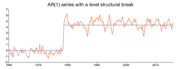
```

  
--

- Unit Root Testing (using ADF Test, KPSS Test)

---

# Questions to Pose

$$\text{Are there multiple cointegrating vectors or just one?}$$
--

- For bivariate series, use **Engle-Granger procedure**
- For more dimensions, use **Johansen Approach**

--


$$\text{Is the cointegrating vector known or does it need to be estimated?}$$

--


$$\text{What deterministic components are included in the cointegrating relationship?}$$

--

$$\text{Do we suspect structural breaks in the cointegrating relationship?}$$

---

# Data Description: Commodity Prices Data

- It is a historic time series data, providing 
  - Information on precious metals' futures including Copper
  - Prices of Gold, Palladium, Platinum, Silver   

<br>

--

- For each commodity we have the following: 
  - Daily opening/closing prices
  - Daily high/low prices 
  - Daily volume reported

<br>

--

- Starting Date : 30th Aug, 2000
- End Date: 17th April, 2024

$$\text{We'll analyze closing prices for Gold, Silver and Copper}$$

---

## Data Analysis: Gold and Silver


- Analyze precious metals Gold and Silver.
--


- Load gold and silver data

```{r, echo=TRUE, eval=TRUE}
gold_data = read.csv("Commodity_Data/Gold_data.csv")
silver_data = read.csv("Commodity_Data/Silver_data.csv")
```

- Storing the data as time Series objects.

```{r, include =TRUE, echo=TRUE}
gold_ts <- ts(log(gold_data$close), start = c(2000, 08), frequency = 12)
silver_ts <- ts(log(silver_data$close), start = c(2000, 08), frequency = 12)
```

```{r, echo=FALSE, out.width="35%",eval=FALSE}
par(mfrow = c(1, 1), mar = c(2.2, 2.2, 1, 2.2), cex = 0.8)
plot.ts(cbind(gold_ts, silver_ts), plot.type = "single", ylab = "", 
    col = 4:3)
legend("topleft", legend = c("gold", "silver"), col = 4:3, 
    lty = 1, bty = "n")
```

---

## Data Analysis (Cont.)

```{r, echo=TRUE, eval=FALSE}

plot.ts(cbind(gold_ts, silver_ts), plot.type = "single", ylab = "", 
    col = 4:3)

```

--

```{r, echo=FALSE, fig.align = 'center', out.height="20%", out.width="50%"}
knitr::include_graphics("snipsgoldsilver/goldsilver.png")
```

--

- We observe that as gold prices increase or decrease, also does the silver prices.

   - Therefore, we suspect if the two series are cointegrated.

---

# Gold: ADF Test (with trend and drift)

```{r, echo=TRUE, eval=FALSE}
adfg1 <- ur.df(gold_ts, type = "trend", selectlags = c("BIC"))
summary(adfg1)
```

```{r, echo=FALSE, out.width="50%"}
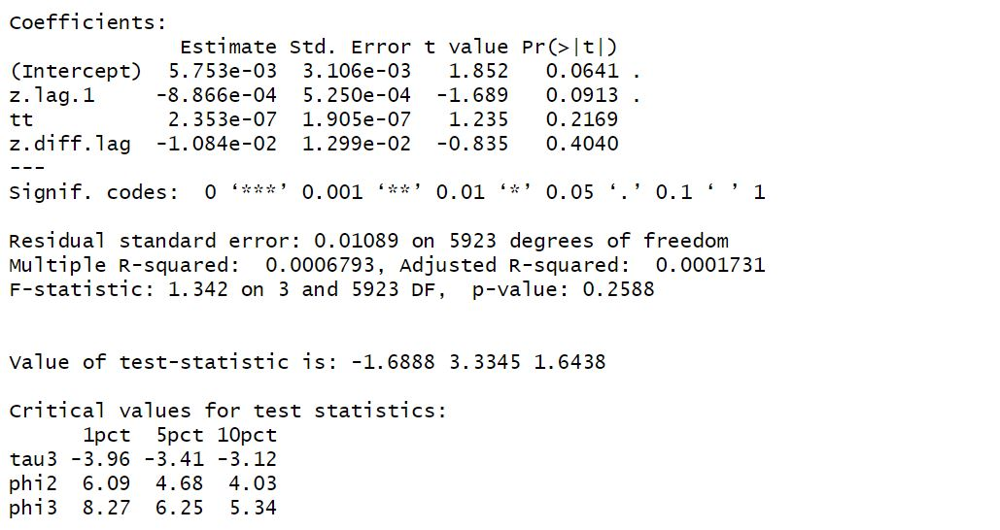
```

$$\text{Null NOT Rejected }(p=0.75) \implies \text{Series has Unit Root}$$

---

# Gold First Difference Series ADF Test
```{r, echo=TRUE, eval=FALSE}
adfg2 <- ur.df(diff(gold_ts), selectlags = c("BIC"))
summary(adfg2)
```

```{r, echo=FALSE, out.width="50%"}
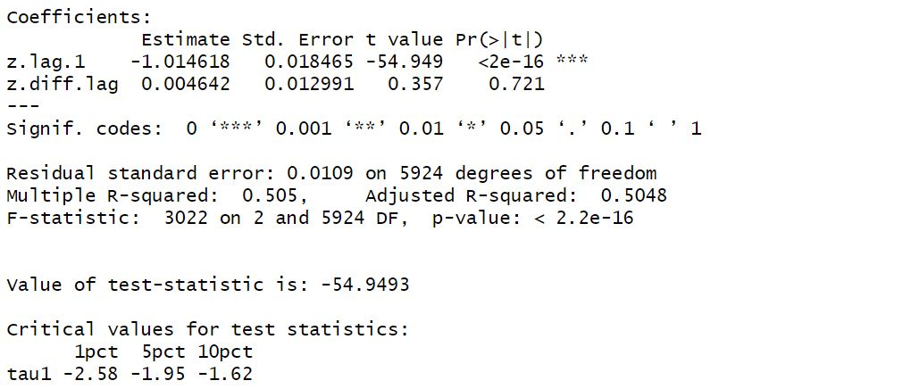
```

$$\text{Null Rejected }(p = 0.01) \implies \text{First Difference STATIONARY}$$


---


# Silver: ADF Test (with trend and drift)

```{r, echo=TRUE, eval=FALSE}
adfs1 <- ur.df(gold_ts, type = "trend", selectlags = c("BIC"))
summary(adfs1)
```

```{r, echo=FALSE, out.width="50%"}
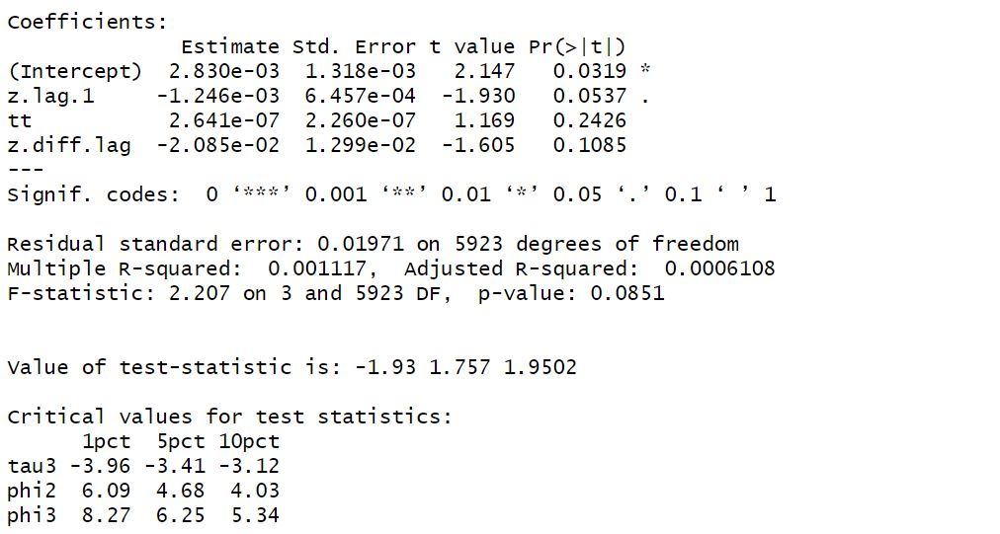
```
$$\text{Null NOT Rejected }(p=0.63) \implies \text{Series has Unit Root}$$


---
# Silver First Difference Series ADF Test

```{r, echo=TRUE, eval=FALSE}
adfs2 <- ur.df(diff(gold_ts), selectlags = c("BIC"))
summary(adfs2)
```


```{r, echo=FALSE, out.width="50%"}
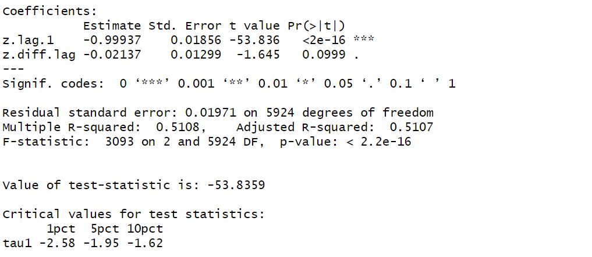
```

$$\text{Null Rejected }(p = 0.01) \implies \text{First Difference STATIONARY}$$

---

## Plotting Residuals

```{r, echo=TRUE, eval=FALSE}
data <- ts.union(gold_ts, silver_ts)
gold.silver.eq <- lm(gold_ts ~ silver_ts, data = data)
plot.ts(gold.silver.eq$residuals)
```


```{r, echo=FALSE, fig.align = 'center', out.height="20%", out.width="60%"}
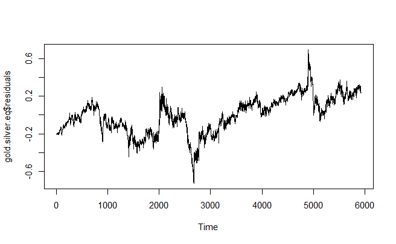
```


$$\text{Residuals appear to be STATIONARY}$$

---

# Residuals

```{r, echo=TRUE, eval=FALSE}
error.gold.silver <- ur.df(gold.silver.eq$residuals, lags = 1, type = "none")
summary(error.gold.silver)
```

```{r, echo=FALSE, out.width="50%"}
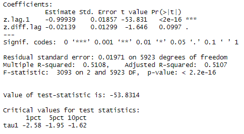
```

$$\text{Null Rejected } \implies \text{Residuals are Stationary } \implies \textbf{} \textbf{ Cointegration}$$


---

# The Error Correction Model (ECM)

- Allows to better understand long-run dynamics
- Measures forces that push relationship towards equilibrium

--

- Assume bivariate system $\boldsymbol{y}_t = (y_{1,t}, y_{2,t})$

--

  - with cointegrating vector $\boldsymbol{\alpha} = (1, -\beta_2)$

--

- ECM Model:

$$\Delta y_{1,t} = c_1 + \delta_1 (y_{1,t} -\beta_2 y_{2,t}) + \sum_{j} \psi_{11}^j \Delta y_{1,t-j} + \sum_{j} \psi_{12}^j \Delta y_{2,t-j} + \epsilon_{1,t}$$

$$\Delta y_{2,t} = c_2 + \delta_2 (y_{1,t} -\beta_2 y_{2,t}) + \sum_{j} \psi_{21}^j \Delta y_{1,t-j} + \sum_{j} \psi_{22}^j \Delta y_{2,t-j} + \epsilon_{2,t}$$

---

## ECM Model Evaluation

```{r, eval=FALSE}
ecm.silver <- lm(silver.d ~ error.ecm1 + gold.d1 + silver.d1)
```

```{r, echo=FALSE, fig.align='left', out.width="70%"}
knitr::include_graphics("snipsgoldsilver/Gold_Silver_ECM.jpg")
```

- Coefficient of $\delta_2$ from ECM model is significant

$$\text{Long term equilibrium established in } \frac{1}{0.002661} \approx 376 \text{ trading days}$$
---

# Data Analysis: Gold vs Copper

- Analyze cheap metal $\text{Copper}$ with $\text{Gold}$ for cointegration

--

- Economic Evidence: **Copper-Gold Ratio**
  -  Lead indicator for 10-year Treasury yield ([Source](https://blogs.cfainstitute.org/investor/2023/03/16/is-the-copper-gold-ratio-a-leading-indicator-on-rates/))
  
--

- Load the $\text{Copper}$ data: 5933 observations

```{r}
gold_data = read.csv("Commodity_Data/Gold_data.csv")
copper_data = read.csv("Commodity_Data/Copper_data.csv")
```


- Preprocess the data

```{r}
excluded_list_date = copper_data[c(259, 1203, 1577, 2582),]$date
copper_data = subset(copper_data,!(date %in% excluded_list_date))
```


```{r, echo=FALSE}
gold_ts <- ts(log(gold_data$close), start = c(2000, 08), frequency = 12)
copper_ts <- ts(log(copper_data$close), start = c(2000, 08), frequency = 12)
```

---

## Gold vs Copper Closing Price

```{r, echo=TRUE, eval=FALSE}

plot.ts(cbind(gold_ts, copper_ts), plot.type = "single", ylab = "", 
    col = 4:3)

```

```{r, echo=FALSE, fig.align = 'center', out.height="20%", out.width="60%"}
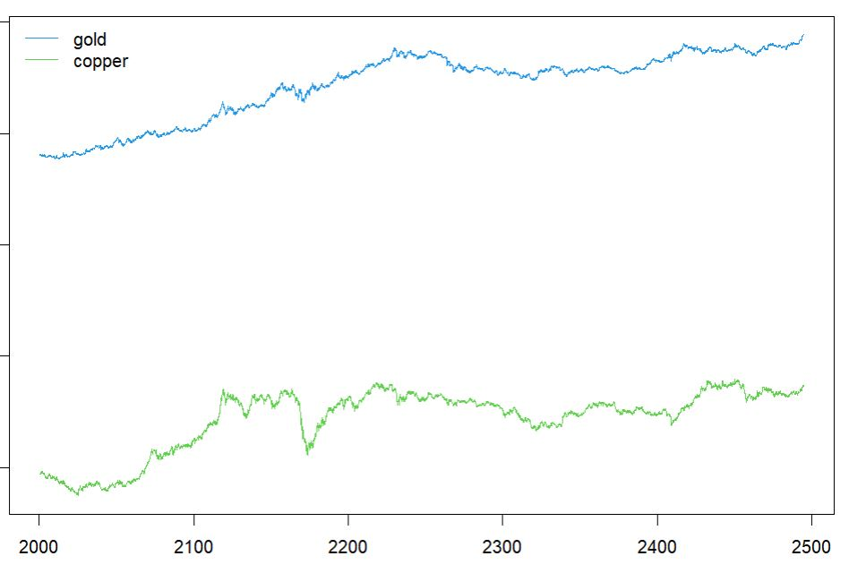
```

---

## Copper: ADF Test (with Trend and Drift)

```{r, echo=TRUE, eval=FALSE}
adfc1 <- ur.df(copper_ts, type = "trend", selectlags = c("BIC"))
summary(adfc1)
```


```{r, echo=FALSE, fig.align='left', out.width="60%", out.height="20%"}
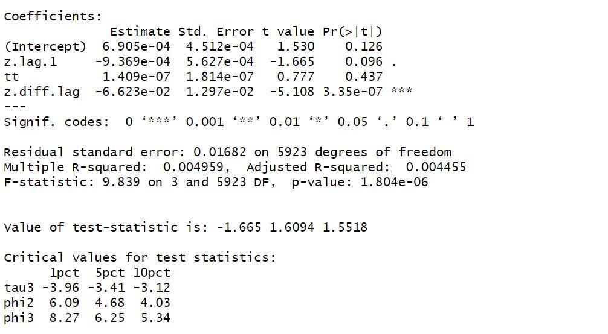
```


$$\text{Null NOT Rejected }(p=0.65) \implies \text{Series has Unit Root}$$

---

## Copper First Difference Series ADF Test

```{r, eval=FALSE}
adfc2 <- ur.df(diff(copper_ts), selectlags = c("BIC"))
```

```{r, echo=FALSE, , out.width="60%"}
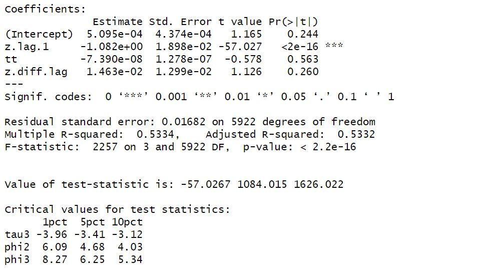
```

$$\text{Null Rejected }(p = 0.01) \implies \text{First Difference STATIONARY}$$

---

## Plotting Residuals


```{r, echo=TRUE, eval=FALSE}
data <- ts.union(gold_ts, copper_ts)
gold.copper.eq <- lm(gold_ts ~ copper_ts, data = data)
plot.ts(gold.copper.eq$residuals)
```


```{r, echo=FALSE, fig.align='center', out.width="60%", out.height="20%"}
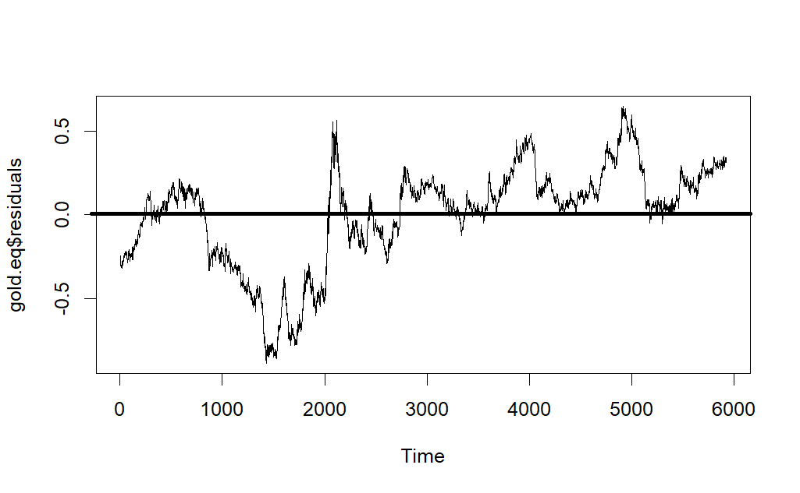
```

$$\text{Residuals appear to be STATIONARY}$$

---

## Residuals: 

```{r, eval=FALSE}
error.gold.copper <- ur.df(gold.copper.eq$residuals, type = "trend", selectlags = c("BIC"))
```

```{r, echo=FALSE, fig.align='left', out.width="70%"}
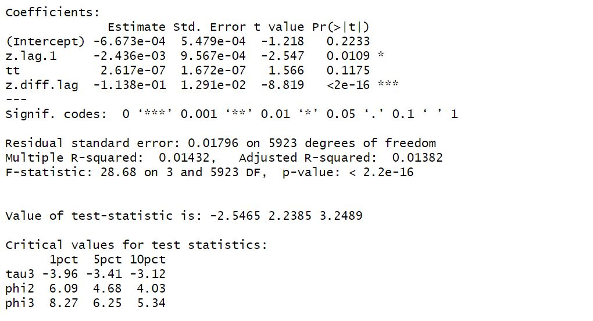
```


$$\text{Null NOT Rejected } \implies \text{Residual has UNIT ROOT } \implies \textbf{NO} \text{ Cointegration}$$

---

```{r, echo=FALSE}
knitr::include_graphics("snipsgoldsilver/TY2.jpg")
```

---

## Appendix: ADF Test Intricacies

- Implementation: $\text{urca}$ package

- Can write ADF Test with 3 values for $\text{type}$

- If we suspect **trend and drift** both:
  
```{r, echo=TRUE, eval=FALSE}
adfc1 <- ur.df(copper_ts, type = "trend", selectlags = c("BIC"))
```

--

  - If we suspect **only drift**:

```{r, echo=TRUE, eval=FALSE}
adfc1 <- ur.df(copper_ts, type = "drift", selectlags = c("BIC"))
```

--

  - If we suspect both trend and drift **absent**

```{r, echo=TRUE, eval=FALSE}
adfc1 <- ur.df(copper_ts, type = "none", selectlags = c("BIC"))
```

--

- More specific Null gives **more power** to test


<!--  THANK YOU & REFERENCES -->