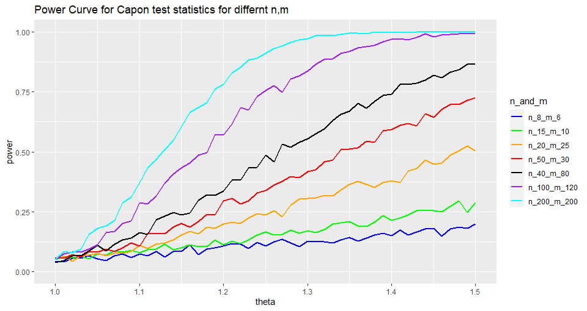
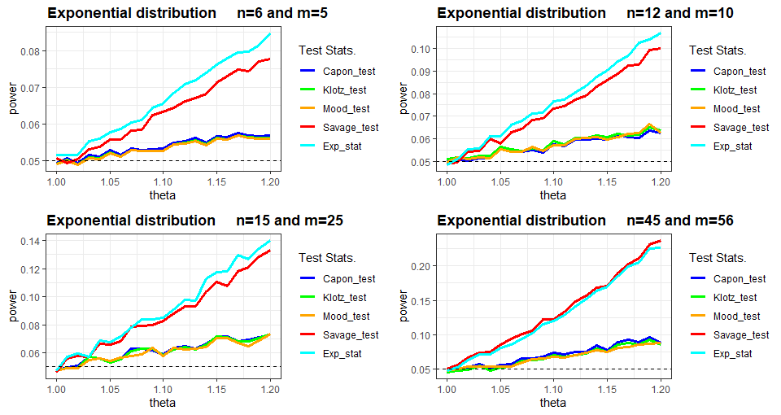

```{r setup, include=FALSE}
knitr::opts_chunk$set(echo = FALSE)

# Search INSERT to add images and tables where required
```

# Motivation

--

We are a F1 race car company using bolts of a specific size to join car parts. We have a new machine to produce bolts

--

Test whether variability of thickness is same or not as original machine

--

Let's consider our options:
$$\text{1. Let the bolts be vary in thickness. Why should we even care?}$$

--

$$\text{2. Apply Parametric Procedures, but what if assumptions are wrong?}$$

--

$$\text{3. Take Non-Paramteric Inference course}$$
--

$$\text{And, use LMP rank tests for scale}$$


```{r,echo=FALSE, fig.align='right', out.width="20%", out.height="20%"}

```


---

# Why not use F test?

Given, the samples of bolts' thickness

$$\text{Original Machine: } X_1 , X_2, ..., X_n$$
$$\text{New Machine: } Y_1 , Y_2, ..., Y_m$$


$$\text{Assume: } \  X_i \sim N(0,1) ; \ Y_j \sim N(0,\sigma^2); \ \   \text{where } \  \sigma^2 > 1$$

$$\text{Test: } \  H_0: \sigma = 1 \ \  \text{vs} \ \ H_1: \sigma > 1$$

Reject $H_0$ for the large values of the statistic at level $\alpha$:

$$\frac{\sum_{i=1}^n (X_i - \bar{X})^2 / (n-1)}{\sum_{j=1}^m (Y_j - \bar{Y})^2 / (m-1)} \sim F_{n-1, m-1}$$

---

# Why not use F test? (contd.)

$$\text{Given, } X_i \sim N(0,1) ; \ Y_j \sim N(0,\sigma^2); \  \text{where} \ \sigma^2 > 1$$

$$\text{Test: } H_0: \sigma = 1 \ \  \text{vs} \ \ H_1: \sigma > 1$$

```{r, fig.align='center', fig.cap= "F-Test Power curve", out.height="70%", out.width="70%"}


```


---


# LMP Rank Tests (Theory)

One option is to use LMP Rank Tests for Scale shift.

Assume independent samples with location parameter $0$:

\\\[X_1, X_2, ..., X_n 	\overset{iid}\sim H(x/ \theta)\\\]
\\\[Y_1, Y_2, ..., Y_m 	\overset{iid}\sim H(x)\\\]

Consider the statistic :
\\\[T = \sum_{i=1}^N c_i.a_N(R_i, f) \ \ ; \ \ \text{N= n+m}\\\]

Under certain conditions, the rank test with critical region
\\\[T \geq k_{\alpha}\\\] 
is LMP Rank Test at level $\alpha$ for

\\\[H_0: \theta = 1 \ \ vs \ \ H_1: \theta > 1\\\]

---

## More about Rank Statistic

$$T = \sum_{i=1}^n c_i.a_N(R_i, f)$$

Constants: $\begin{equation} c_i = \begin{cases} -1 & \text{, } i^{th} \text{ observation corresponds to X} \\ 0         & \text{, otherwise} \end{cases} \end{equation}$

Score functions: $$a_N(i,f) = \mathbb{E} \left[\frac{f'( X_{(i)}, 0)}{f( X_{(i)}, 0)} \right]$$

Using the relation, we find out scores corresponding LMP Rank Tests For different underlying distribution

$$f(x; \theta) = e^{\theta} h(e^{\theta} . x)$$

---

# Score functions

|Distribution| Score function for X(i) |
|---|---|
|Normal(0,1)| $\ \ \mathbb{E}[Z_{(i, N)}^2]$ |
|Exponential(1) | $\ \ \mathbb{E}[X_{(i, N)}] = \sum_{j=R_i}^N \frac{1}{N+1-j}$ |
|Gamma(k,1) | $\ \ \mathbb{E}[X_{(i, N)}]$ |
|Weibull(k,1) | $\ \ \mathbb{E}[X_{(i, N)}^k]$ |
|Cauchy(0,1) | $\ \ - \mathbb{E}[ 1/ (1+ X_{(i, N)}^2)]$ |
|Laplace(0,1) | $\ \ \mathbb{E}[ \mid X_{(i, N)} \mid]$ |

---

# Generating Score Functions

At first, calculating score function for Normal distribution simulation was tried 5000 replications

Idea: Using Law of Large Numbers, try to get a close value for the score function

--

- Generate a sample from N=200. Sort the values
- Repeat for 5000 times
- Report score function using $\mathbb{E}[g(X_{(i)}] = \frac{1}{5000} \sum_{r=1}^{5000} g(\widehat{X_{(i,r)}})$


--

\\\[ \text{IT WAS NOT A GOOD IDEA}\\\]

\\\[ \text{Problems}\\\]

\\\[ \text{1. Computation took too long}\\\]
\\\[ \text{2. Obtained values were not precise}\\\]

---

## Generating Score Functions Faster

Idea: How about using the order statistics formula

$\mathbb{E}[g(X_{(i)})] =  \int_{- \infty}^{\infty} g(x) {N \choose i} \ i \ F(x)^{i-1} f(x) (1 - F(x))^{N-i} \ dx$

Implementation: Use integral function from 'pracma' library

Example: $\mathbb{E}[Z_{(3,6)}^2]$

```{r,echo=TRUE}
f <- function(x, i, N) {
  pdf <-  choose(N, i) * i * (pnorm(x,0,1) ^ (i-1)) * dnorm(x,0,1) * ((1- pnorm(x,0,1)) ^ (N-i))
  return( pdf * x^2)
}

{{ pracma::integral(fun = f, xmin = -Inf, xmax = Inf, 
                 i = 3, N = 6) }}
```

---
## Generating Score Functions blazingly fast

Idea: Use parallel programming to calculate results faster

Implementation: Use multiple cores of our machine

```{r, fig.align='center', out.height="70%", out.width="70%"}


```

---

# Linear Rank Statistics for Scale

Capon Test Statistic : $C = \sum_{i=1}^n \mathbb{E}[Z_{R_i,N}^2]$

Klotz Test Statistic: $K = \sum_{i=1}^n (\Phi^{-1}(\frac{R_i}{N+1}))^2$
 
Mood Test Statistic:  $M = \sum_{i=1}^n (R_i - \frac{N+1}{2})^2$

Savage Test Statistic: $S = \sum_{i=1}^n \sum_{j=1}^{R_i} \frac{1}{N+i-j}$

- Capon Test Statistic uses score from Normal Distribution
- Savage Test Statistic uses score Exponential Distribution

---

# Distribution under Null Hypothesis

Under $H_0$, these statistics are distribution free

```{r, fig.align='center', out.height="80%", out.width="80%"}
knitr::include_graphics("Image/capon_alternate_theta_1.jpeg")

```

---


# Distribution under Null Hypothesis


```{r, fig.align='center', out.height="80%", out.width="80%"}


```

---

# Distribution under Null Hypothesis


```{r, fig.align='center', out.height="80%", out.width="80%"}


```

---

# Distribution under Null Hypothesis


```{r, fig.align='center', out.height="80%", out.width="80%"}


```

---

# Distribution under Alternative Hypothesis

Under $H_1$, these statistics would not remain distribution free. $\theta = 3$

```{r, fig.align='center', out.height="80%", out.width="80%"}


```

---


## Distribution under Alternative Hypothesis

$$\theta = 3$$

```{r, fig.align='center', out.height="80%", out.width="80%"}


```

---

## Distribution under Alternative Hypothesis

$$\theta = 3$$

```{r, fig.align='center', out.height="80%", out.width="80%"}


```

---

## Distribution under Alternative Hypothesis

$$\theta = 3$$

```{r, fig.align='center', out.height="80%", out.width="80%"}


```

---

## Size of the Test 

<font size="4.5">Level of significance = 0.05</font>


```{r,echo=FALSE, fig.align='center'}


```

- <font size="4.5"> For $N < 20$ : Size of test differs a lot from the level of significance for Mood and Klotz 
- For $N \geq 20$ : Size of the test is almost same as level of significance for all tests. </font>


---
## Capon's statistic under Normal Distribution 
```{r,echo=FALSE, fig.align='center'}

```

- <font size="4.5"> We waited for a week for this plot to show up. </font>

---

## Savage's statistic under Exponential Distribution 
```{r,echo=FALSE, fig.align='center'}


```

---

## Consistency of Capon Test under Normal Population
```{r,echo=FALSE, fig.align='center', out.height="150%", out.width="150%"}


```

---

## Consistency of Non Parametric Tests under Normal Population
```{r,echo=FALSE, fig.align='center', out.height="150%", out.width="150%"}


```
- <font size="4"> Not only Capon but Klotz and Mood are also consistent. But rate of convergence to 1 for Savage is very low. </font>

---

## Consistency of Non Parametric Tests under Logistic Population
```{r,echo=FALSE, fig.align='center', out.height="150%", out.width="150%"}


```
- <font size="4"> Power decays a little bit but still Capon, Klotz and Mood are working fine. </font>

---

## Consistency of Non Parametric Tests under Laplace Population
```{r,echo=FALSE, fig.align='center', out.height="150%", out.width="150%"}


```
- <font size="4"> Power again decays a little bit but still Capon, Klotz and Mood are working fine. </font>

---
## Consistency of Non Parametric Tests under Cauchy Population
```{r,echo=FALSE, fig.align='center', out.height="150%", out.width="150%"}


```

---

## Consistency of Non Parametric Tests under Exponential Population
```{r,echo=FALSE, fig.align='center', out.height="150%", out.width="150%"}


```
- <font size="4"> Under Exponential distribution Savage has very high convergence rate whereas other statistics have very low rate of convergence.  </font>

---

## Comparison of Capon test under Different Population

```{r,echo=FALSE, fig.align='center',out.height= "90%" , out.width="90%"}


```
- <font size="4"> This is similar to what we had seen in test for location difference. </font>
- <font size="4"> Ex. Kurtosis  : Normal < Logistic < Laplace < Cauchy </font>
- <font size="4"> Power  :  Normal > Logistic > Laplace > Cauchy </font>

---

## Comparison of Savage tests under Different Population 

```{r,echo=FALSE, fig.align='center', out.height="90%", out.width="90%"}


```
- Savage is also showing the same behavior except for parent population (Exponential)

---
## Parametric Counterpart of Capon and Savage test
- Setup: For independent samples with location parameter 0
 $$X_1, X_2, ..., X_n 	\overset{iid}\sim H(x/ \theta)$$
 $$Y_1, Y_2, ..., Y_m 	\overset{iid}\sim H(x)$$
- Recall our Hypothesis : $H_0: \theta = 1 \ \ vs \ \ H_1: \theta > 1$ 

- Here $\theta$ is ratio of scale parameters of X population to Y population.        

- We know that Capon test is LMPR test under Normal distribution.                               

- For Normal Population Hypothesis can be written as   
 $$H_0: \sigma_x = \sigma_y \ \ vs \ \ H_1: \sigma_x > \sigma_y$$ 
  
---

### Parametric Counterpart of Capon and Savage test                                                                                                                                                                                                                                                                                                                                                                                          
- First Parametric counterpart for this hypothesis that would come in mind is F test:  

 $$F = \frac{{\sum_{i=1}^n X_i^2}/n}{{\sum_{j=1}^m Y_j^2}/m}$$ 
 
- Under $H_0$, F follows $F_{(n,m)}$ - distribution                                                 
- Similarly, parametric counterpart for Savage statistics( parent population : Exponential) is  


$$E = \frac{{\sum_{i=1}^n X_i}/n}{{\sum_{j=1}^m Y_j}/m}$$

- Under $H_0$, $\text{E}$ follows $F_{(2n,2m)}$ - distribution

---
## Domination of F  under Normal Population
```{r,echo=FALSE, fig.align='center', out.height="150%", out.width="150%"}
  

```

---
## Capon Vs F-test
```{r,echo=FALSE, fig.align='center', out.height="100%", out.width="100%"}


```
- <font size="4"> Capon outperformed F-test under Cauchy Population. </font>
- <font size="4"> Other than Normal Population, Capon is performing better than F-test.</font>
---

## Capon Vs F-test: Exponential Population

```{r,echo=FALSE, fig.align='center', out.height="50%", out.width="60%"}


```
- <font size="4"> Under Exponential distribution F test is performing way better than Capon test. </font>

---


## Power curve for Parametric Counterpart of Savage
```{r,echo=FALSE, fig.align='center', out.height="100%", out.width="100%"}


```
- <font size="4"> Parametric counterpart will perform better, but power curve of savage is getting closer and closer to power curve corresponding to E-test as sample size increases </font>

---
## Savage  Vs E-test

```{r,echo=FALSE, fig.align='center', out.height="100%", out.width="100%"}


```

--

\\\[ \text{Savage being savage to E-test}\\\]

---

# Asymptotics

Define, $\widetilde{T_N} = \sum_{i=1}^n c_i a_N(R_i)$ where $\begin{equation} c_i = \begin{cases} \frac{1}{n} & \text{, } i^{th} \text{ observation corresponds to X} \\ 0         & \text{, otherwise} \end{cases} \end{equation}$

By Chernoff-Savage Theorem, $\frac{\widetilde{T_N} - \mu_N}{\sigma_N} \sim N(0,1)$

Under $H_0$, 
\\\[\mu_N = \int_0^1 J(u) du\\\]
\\\[\ N \sigma^2 = \frac{1 - \lambda_N}{\lambda_N} \left[ \int_0^1 J^2(u) du - (\int_0^1J(u)du)^2 \right]\\\]

where $J(u) = \lim_{n \to \infty } J_N(u)$

\\\[ J_N(u) = a_N(i) ; \ \ \frac{i-1}{N+1} < u \leq \frac{i}{N+1}\\\]

---

## Transforming the Statistics

\\\[\text{As  } N \to \infty ,\\\]
\\\[ \text{Capon :} \frac{C/n - 1}{\sqrt{\frac{2m}{nN}}} \to N(0,1)\\\]

\\\[ \text{Klotz :} \frac{K/n - 1}{\sqrt{\frac{2m}{nN}}} \to N(0,1)\\\]

\\\[ \text{Mood :} \frac{ \frac{M}{n(N+1)^2} - \frac{1}{12}}{\sqrt{\frac{m}{180.nN}}} \to N(0,1)\\\]

\\\[ \text{Savage :} \frac{C/n - 1}{\sqrt{\frac{n}{mN}}} \to N(0,1)\\\]

---

## Asymptotic Distribution (Capon)

```{r, fig.align='center', out.height="100%", out.width="90%"}


```

---

## Asymptotic Distribution (Capon)

```{r, fig.align='center', out.height="100%", out.width="90%"}


```

---

## Asymptotic Distribution (Klotz)

```{r, fig.align='center', out.height="100%", out.width="90%"}


```

---

## Asymptotic Distribution (Klotz)

```{r, fig.align='center', out.height="100%", out.width="90%"}


```

---

## Asymptotic Distribution (Mood)

```{r, fig.align='center', out.height="100%", out.width="90%"}


```

---

## Asymptotic Distribution (Mood)

```{r, fig.align='center', out.height="100%", out.width="90%"}


```

---

## Asymptotic Distribution (Savage)

```{r, fig.align='center', out.height="100%", out.width="90%"}


```

---

## Asymptotic Distribution (Savage)

```{r, fig.align='center', out.height="100%", out.width="90%"}


```

---
### Asymptotic Equivalence of Capon & Klotz

Here, we have the distribution of the Capon & Klotz statistics

```{r, fig.align='center', out.height="100%", out.width="90%"}


```

--

\\\[\text{But, does distributional equivalence} \implies \text{asymptotic equivalence ?}\\\]

--

\\\[ \text{NO..!!!}\\\]

---

### Asymptotic Equivalence of Capon & Klotz

Idea: Compare all scores from $i= 1, 2, ..., n$

```{r, fig.align='center', out.height="70%", out.width="70%"}


```

---

# Violations

All nice graphs, till now were based on 'certain' assumptions.

Given independent samples where 
\\\[X_1, X_2, ..., X_n \overset{iid}{\sim} H(x/ \theta)\\\] 
\\\[Y_1, Y_2, ..., Y_m \overset{iid}{\sim} H(x)\\\]

--

\\\[ \text{But, what if our assumptions are violated?}\\\]

Let's work with the following idea:

\\\[\text{What if the} \ X_is \ \text{were dependent?}\\\]

--

May be the statistic will not be distribution-free under $H_0$
Implementation: For i=2 to n, iteratively perform 
$$X_i' = X_i - X_{i-1}$$

---

### Violation: Dependent X observations

\\\[ \text{Capon Test Statistic}\\\]

```{r, fig.align='center', out.height="80%", out.width="80%"}
knitr::include_graphics("Image\\violation_capon.jpeg")

```

---

### Violation: Dependent X observations

\\\[ \text{Mood Test Statistic}\\\]

```{r, fig.align='center', out.height="80%", out.width="80%"}
knitr::include_graphics("Image\\violation_mood.jpeg")

```

---

### Violation: Dependent X observations

\\\[ \text{Savage Test Statistic}\\\]

```{r, fig.align='center', out.height="80%", out.width="80%"}
knitr::include_graphics("Image\\violation_savage.jpeg")

```

---

### Violation: Dependent X observations

\\\[ \text{Klotz Test Statistic}\\\]

```{r, fig.align='center', out.height="80%", out.width="80%"}
knitr::include_graphics("Image\\violation_klotz.jpeg")

```

---

## Violations

But, we see that Klotz test statistic might still be distribution free.

--

\\\[ \text{Intuitive Reason}\\\]
Dependence structure introduced in sample of $X_is$ is unable to cause different changes for different underlying distribution

--

\\\[ \text{Idea: Introduce dependence structure in } Y_js \\\]

\\\[ \text{Implementation: For j=2 to m, iteratively perform } \\\]

$$Y_j' = Y_j + Y_{j-1}$$ 

---

### Violation: Dependent X & Dependent Y observations

\\\[ \text{Klotz Test Statistic}\\\]

```{r, fig.align='center', out.height="80%", out.width="80%"}
knitr::include_graphics("Image\\tmp_violations_klotz.jpeg")

```

---

# LMP Scale for Gamma

Let's work with Gamma Distribution with shape parameter, $\alpha = 5$
$$\begin{eqnarray} h(x) &=& \frac{x^{\alpha -1}}{\Gamma(\alpha)} e^{-x} \\ f(x; \theta) &=& e^{\theta}. h(e^{\theta} x) \\ \implies ln f(x; \theta) &=& \alpha \theta + ln(\frac{x^{\alpha -1}}{\Gamma(\alpha)}) - e^{\theta}x \\ \implies \frac{f'(x; \theta)}{f(x; \theta)} &=& \alpha - e^{\theta} x\end{eqnarray}$$
Score function:

$$\begin{eqnarray} a_N(i,f) &=& \mathbb{E} \left[ \frac{f'(X_{(i)}; 0)}{f(X_{(i)}; 0)} \right] &=& \alpha  - \mathbb{E} [X_{(i)}]\end{eqnarray}$$
---

## LMP Scale for Gamma

And, the LMP Rank test is the one which rejects $H_0$ when:

$$\begin{eqnarray} \sum_{i=1}^n c_i a_N(i,f) &\geq& k_{\alpha} \\ \implies - \sum_{i=1}^n\mathbb{E}[ \frac{f'(X; 0)}{f(X; 0)}] &\geq& k_{\alpha} \\ \implies - n \alpha + \sum_{i=1}^n \mathbb{E} [X_{(i)}] &\geq& k_{\alpha} \\ \implies \sum_{i=1}^n \mathbb{E}[X_{(i)}] &\geq& k_{\alpha}^{\prime}\end{eqnarray}$$

--

$$\sum_{i=1}^n \mathbb{E}[X_{(i)}] :  \text{Gupta - Shinde Test Statistic ?}$$

--

```{r, fig.align='right', out.height="30%", out.width="30%"}
knitr::include_graphics("Image-Meme\\boys.png")

```

---

## LMP Scale for Gamma

Distribution under Null: $\theta = 0$

```{r, fig.align='center', out.height="80%", out.width="80%"}
knitr::include_graphics("Image\\gs_alternate_theta_1.jpeg")

```

---

## LMP Scale for Gamma

Distribution under Alternative: $\theta = 3$

```{r, fig.align='center', out.height="80%", out.width="80%"}
knitr::include_graphics("Image\\gs_alternate_theta_3.jpeg")

```

---

## Gamma Distribution: UMP Counterpart

We'll use simplified version for the UMP tests 
$$X_1, X_2, ..., X_n \overset{iid}{\sim} Gamma(k, \beta)$$

$$Y_1, Y_2, ..., Y_m \overset{iid}{\sim} Gamma(k, 1)$$

Let's try developing UMP parametric test for:
\\\[H_0: \beta = 1 \ \text{vs} \ H_1:\beta = \beta_0 > 1\\\]

Using Neymann-Pearson Lemma, UMP parametric tests:

$$\begin{eqnarray}\sum_{i=1}^n X_i \geq k_{\alpha} \end{eqnarray}$$
UMP Test for $H_0$ vs $H_1$: $\sum_{i=1}^n X_i \geq   \psi_{\alpha}; \ \ \ \psi \sim Gamma(nk, 1)$

---

## Gamma Distribution: Power Curve

```{r, fig.align='center', out.height="90%", out.width="90%"}
knitr::include_graphics("Image\\gs_gamma_power_curve_changed.jpeg")

```

---

```{r, fig.align='center', out.height="70%", out.width="100%"}
knitr::include_graphics("Image-Meme\\TY2.jpg")

```

---

## Two other test statistics

### 1. Wilcoxon signed rank(WSR):
- <font size="3"> Yes! Wilcoxon Signed Rank test can also be used to test the difference in scale parameters of two populations. (Reject the test for larger values of WSR) </font>
<font size="2"> $$WSR= \sum_{1=1}^n R_{(i,N)}^*$$ </font>

### 2. Modified Median test for scale:
-  If I replace $R_{(i,N)}$ by $R_{(i,N)}^*$ in Median-test. It can also be used to test difference in scale parameter for different populations. 
<font size="2"> $$Y = \frac{\displaystyle\sum_{i=1}^n {\left(\text{sgn}\left(R_{(i,N)}^*- \frac{N+1}{2}\right)+1\right)}}{2}$$ </font>
---
## Wilcoxon signed rank(WSR) under different populations

```{r,echo=FALSE, fig.align='center', out.height="100%", out.width="100%"}


```
---

## Modified Median test under different population

```{r,echo=FALSE, fig.align='center', out.height="100%", out.width="100%"}


```
---
## Are these better than Capon?

```{r,echo=FALSE, fig.align='center', out.height="57%", out.width="57%"}
par(mfrow=c(1,2))
knitr::include_graphics(c("Image-Yash/Capon under all dist.jpg","Image-Yash/WSR_test_all_dist1.jpg"))

```